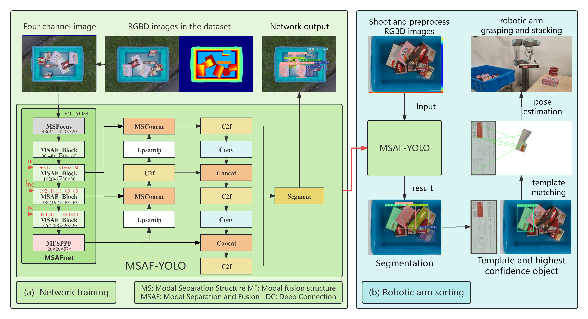

# MSAF-YOLO
MSAF-YOLO in Box shaped object sorting based on multi-modal information.

## Box shaped object sorting based on multi-modal information
In modern industrial logistics, the efficient sorting of box-shaped objects is a critical link to ensure the smooth operation of supply chains. 
However, there remains a lack of corresponding classification and grasping methods for complex scenarios. 
With the advancement of depth camera technology, obtaining texture and depth information of objects has become increasingly convenient, providing new opportunities to enhance the intelligence level of sorting systems. 
To this end, this paper proposes an innovative box-shaped object sorting system based on multi-modal information. 
This method integrates image instance segmentation, template matching algorithms, and robotic arm operations, achieving efficient and accurate sorting of box-shaped objects with varying sizes, colors, and materials. 
The system develops a multi-modal multi-level fusion instance segmentation network, MSAF-YOLO, based on YOLO, which takes RGBD inputs. 
It is trained using the synthetic datasets Snack-Box. Through multiple sets of experiments, the feasibility of this method was confirmed, and the optimal network architecture was determined. 
Experimental results show that MSAF-YOLO (with 38.646M parameters and 147.760G FLOPs) improved the mAP50 and mAP50-95 metrics by 2.3% and 3.67%, respectively, compared to YOLOv8m (RGB). 
MSAF-YOLO (with 65.965M parameters and 308.393G FLOPs) outperformed the state-of-the-art RGBD methods by 1.1% and 1.76% in the same metrics. 
In nearly 1,000 scene experiments, MSAF-YOLO achieved a successful grasping rate of 92.33%. 
Compared with YOLOv8m, the average error reduction is 19.63%. 
Our code are available at: https://github.com/JKDWYQ/MSAF-YOLO.

## Frame diagram
<p align="center">  </p>

## Requirements

```python
pip install -r requirements.txt
conda install pytorch==2.0.0 torchvision==0.15.0 torchaudio==2.0.0 pytorch-cuda=11.8 -c pytorch -c nvidia
```

## Dataset
Download Snack-box data for our experiment from [baiduyun](https://pan.baidu.com/s/1vOP-07bA4J0JIjOj-wPNKg?pwd=1111). And the path of dataset is like that
```python
MSAF-YOLO
├── dataset
│   ├── Snack-box
│   │   ├── test
│   │   ├── train
│   │   ├── valid
```

## Demo
```python
python train_demo.py
```
If it runs successfully, you will receive
```python
                   from  n    params  module                                       arguments                     
  0                  -1  1      1824  ultralytics.nn.modules.conv.Conv             [4, 48, 3, 2]                 
  1                  -1  1     41664  ultralytics.nn.modules.conv.Conv             [48, 96, 3, 2]                
  2                  -1  2    111360  ultralytics.nn.modules.block.C2f             [96, 96, 2, True]             
  3                  -1  1    166272  ultralytics.nn.modules.conv.Conv             [96, 192, 3, 2]               
  4                  -1  4    813312  ultralytics.nn.modules.block.C2f             [192, 192, 4, True]           
  5                  -1  1    664320  ultralytics.nn.modules.conv.Conv             [192, 384, 3, 2]              
  6                  -1  4   3248640  ultralytics.nn.modules.block.C2f             [384, 384, 4, True]           
  7                  -1  1   1991808  ultralytics.nn.modules.conv.Conv             [384, 576, 3, 2]              
  8                  -1  2   3985920  ultralytics.nn.modules.block.C2f             [576, 576, 2, True]           
  9                  -1  1    831168  ultralytics.nn.modules.block.SPPF            [576, 576, 5]                 
 10                  -1  1         0  torch.nn.modules.upsampling.Upsample         [None, 2, 'nearest']          
 11             [-1, 6]  1         0  ultralytics.nn.modules.conv.Concat           [1]                           
 12                  -1  2   1993728  ultralytics.nn.modules.block.C2f             [960, 384, 2]                 
 13                  -1  1         0  torch.nn.modules.upsampling.Upsample         [None, 2, 'nearest']          
 14             [-1, 4]  1         0  ultralytics.nn.modules.conv.Concat           [1]                           
 15                  -1  2    517632  ultralytics.nn.modules.block.C2f             [576, 192, 2]                 
 16                  -1  1    332160  ultralytics.nn.modules.conv.Conv             [192, 192, 3, 2]              
 17            [-1, 12]  1         0  ultralytics.nn.modules.conv.Concat           [1]                           
 18                  -1  2   1846272  ultralytics.nn.modules.block.C2f             [576, 384, 2]                 
 19                  -1  1   1327872  ultralytics.nn.modules.conv.Conv             [384, 384, 3, 2]              
 20             [-1, 9]  1         0  ultralytics.nn.modules.conv.Concat           [1]                           
 21                  -1  2   4207104  ultralytics.nn.modules.block.C2f             [960, 576, 2]                 
 22        [15, 18, 21]  1   5205344  ultralytics.nn.modules.head.Segment          [80, 32, 192, [192, 384, 576]]
YOLOv8m-seg summary: 331 layers, 27286400 parameters, 27286384 gradients, 110.735 GFLOPs
```
And the path of result is like that
```python
MSAF-YOLO
├── runs
│   ├── yolov8m-seg_Snack-box-demo_test
│   │   ├── weights
│   │   ├── args.yaml
```
## Results
|  **Method**   | Params(M)    | GFLOPs |  **mAP50**  | **mAP50-95** |
|:-------------:|--------------|--------|:-----------:|:------------:|
| YOLOv8m(RGB)  | 27.23        | 110    |    0.940    |    0.874     |
| YOLOv11m(RGB) | 22.37        | 123    |    0.953    |    0.883     |
|      REF      | 39.4         | 150    |    0.949    |    0.892     |
|     FIRI      | 24.6         | 208    |    0.928    |    0.878     |
|      CFT      | 81.1         | 137    |    0.953    |    0.896     |
|     CMMHA     | 47.4         | 173    |    0.930    |    0.872     |
|   SuperYOLO   | 16.1         | 373    |    0.954    |    0.886     |
|    OUR(m)     | 38.646       | 148    | ***0.964*** | ***0.911***  |
|    OUR(l)     | 65.965       | 308    | ***0.965*** | ***0.914***  |

[sorting video demo](./sorting_demo.mp4), Download sorting video from [baiduyun](https://pan.baidu.com/s/1G_17LfjwpyVudN11nNGn_Q?pwd=1111)

## Acknowledgements
This code is built on [YOLOv8](https://github.com/ultralytics/ultralytics/releases/tag/v8.0.139). We thank the authors for sharing the codes.
